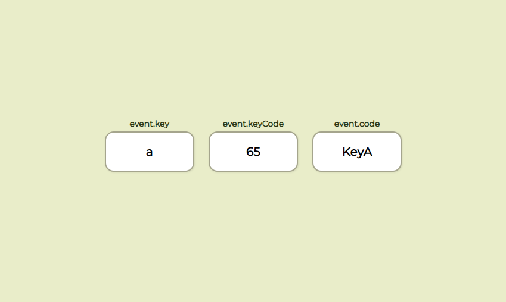
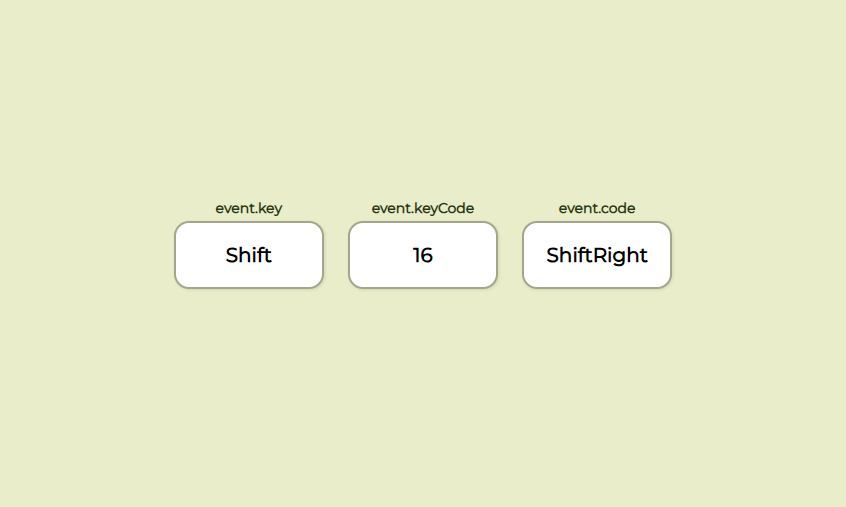

# ⌨️ Keycode Event Viewer

A simple web project that displays the **key code**, **key**, and **event information** for any keyboard key you press.  
Built using **JavaScript**, **HTML**, and **CSS** — great for beginners learning about keyboard events.

---

## 🎯 Features

- Shows pressed key in real time  
- Displays:
  - `event.key`
  - `event.keyCode`
  - `event.code`
---

## 🎥 Preview

<p align="center">
  
  

</p>

---

## 📦 Setup

```bash
# Clone the repository
git clone https://github.com/yigitkagankartal/keyCode.git
